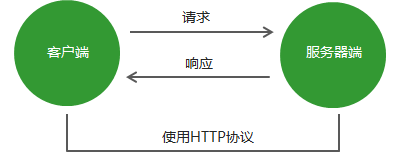

# 系统模块

## fs

f：file 文件 ，s：system 系统，文件操作系统。

```js
fs.reaFile('文件路径/文件名称'[,'文件编码'], callback); // 读取文件
fs.writeFile('文件路径/文件名称', '数据', callback); // 写入文件
```

## path

路径操作

路径拼接原因：不同操作系统的路径分隔符不统一

Windows 上是 `\ /` ， Linux 上是 `/`

```js
path.join('路径', '路径', ...)
```

- 大多情况使用绝对路径，相对路径相对命令行工具当前工作目录

- 读取文件或者设置文件路径时都会选择绝对路径

- 使用`__dirname`获取当前文件所在绝对路径

## http

### http 协议

**超文本传输协议**（英文：HyperText Transfer Protocol，缩写：**HTTP**）规定了如何从网站服务器传输超文本到本地浏览器，它基于客户端服务器架构工作，是客户端（用户）和服务器端（网站）请求和应答的标准。



### 报文

在 HTTP 请求和响应的过程中传递的数据块就叫报文，包括要传送的数据和一些附加信息，并且要遵守规定好的格式。

#### 请求报文

请求方式 （Request Method）

- GET 请求数据
- POST 发送数据

请求地址 （Request URL）

```js
app.on('request', (req, res) => {
  req.headers // 获取请求报文
  req.url // 获取请求地址
  req.method // 获取请求方法
})
```

#### 响应报文

HTTP 状态码

- 200 请求成功

- 404 请求的资源没有被找到

- 500 服务器端错误

- 400 客户端请求有语法错误

内容类型

- text/html
- text/css
- application/javascript
- image/jpeg
- application/json

```js
app.on('request', (req, res) => {
  // 设置响应报文
  res.writeHead(200, { 'Content-Type': 'text/html;charset=utf8' })
})
```

### 创建 web 服务器

```js
// 引用系统模块
const http = require('http')
// 创建web服务器
const app = http.createServer()
// 当客户端发送请求的时候
app.on('request', (req, res) => {
  //  响应
  res.end('<h1>hi, user</h1>')
})
// 监听3000端口
app.listen(3000)
console.log('服务器已启动，监听3000端口，请访问 localhost:3000')
```

### 获取参数

#### GET 请求

参数被放置在浏览器地址栏中，例如：`http://localhost:3000/?name=zhangsan&age=20`

参数获取需要借助系统模块 url，url 模块用来处理 url 地址

请求途径：浏览器地址栏、link 标签的 href 属性、script 标签的 src 属性、img 标签的 src 属性、Form 表单提交

```js
const http = require('http')
// 导入url系统模块 用于处理url地址
const url = require('url')
const app = http.createServer()
app.on('request', (req, res) => {
  // 将url路径的各个部分解析出来并返回对象
  // true 代表将参数解析为对象格式
  let { query } = url.parse(req.url, true)
  console.log(query)
})
app.listen(3000)
```

#### POST 请求

参数被放置在请求体中进行传输

获取 POST 参数需要使用 data 事件和 end 事件

使用 querystring 系统模块将参数转换为对象格式

请求途径：Form 表单提交

```js
 // 导入系统模块querystring 用于将HTTP参数转换为对象格式
 const querystring = require('querystring');
 app.on('request', (req, res) => {
     let postData = '';
     // 监听参数传输事件
     req.on('data', (chunk) => postData += chunk;);
     // 监听参数传输完毕事件
     req.on('end', () => {
         console.log(querystring.parse(postData));
         // parse默认为false，返回Object
     });
 });
```

> 如果要解析数据，要在 end 事件中解析

### 路由

路由是指客户端请求地址与服务器端程序代码的对应关系。简单的说，就是请求什么响应什么。

```js
// 当客户端发来请求的时候
app.on('request', (req, res) => {
  // 获取客户端的请求路径
  let { pathname } = url.parse(req.url)
  if (pathname == '/' || pathname == '/index') {
    res.end('欢迎来到首页')
  } else if (pathname == '/list') {
    res.end('欢迎来到列表页页')
  } else {
    res.end('抱歉, 您访问的页面出游了')
  }
})
```

### 静态资源

服务器端不需要处理，可以直接响应给客户端的资源就是静态资源，例如 CSS、JavaScript、image 文件。

### 动态资源

相同的请求地址不同的响应资源，这种资源就是动态资源。
